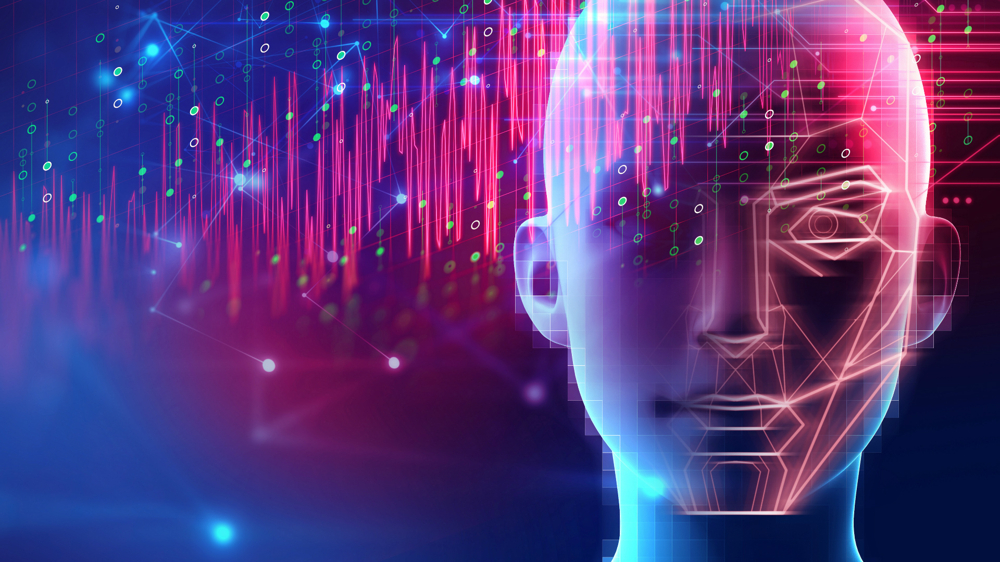

## Artificial Intelligence is for Everyone
*Hello and welcome my blog. Let's talk data Science.*

## Usefull resources to get started with deep learning Deep Learning
 
- [link to deep learning for coders](https://www.fast.ai)(by Jeremy Howard and Sylvain Gugger) 
- [link to MIT course for deep learning](http://introtodeeplearning.com/)(by Jeremy Howard and Sylvain Gugger) 
- [Link to Coursera deep learning course ](https://www.coursera.org/learn/neural-networks-deep-learning-fr/home/welcome)(by Andrew Ng) 
